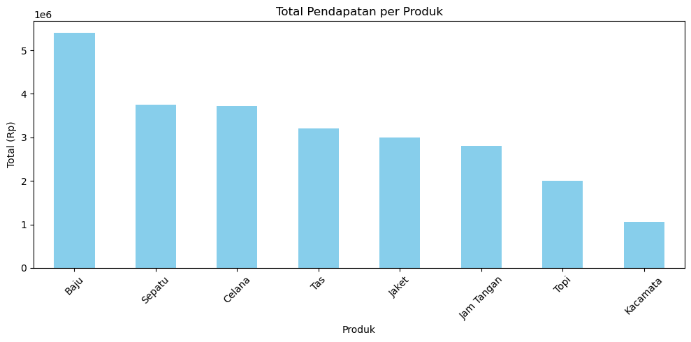

# 🛒 Analisis Penjualan Toko Fiktif

Proyek ini merupakan analisis data penjualan dari sebuah toko fiktif yang menjual berbagai macam produk. Tujuannya adalah untuk mengetahui produk paling laris, produk dengan pendapatan tertinggi, serta memberikan insight yang berguna untuk strategi bisnis.

---

## 📁 Dataset

File: `penjualan.csv`  
Kolom:
- `Tanggal` → Tanggal transaksi
- `Produk` → Nama produk yang terjual
- `Jumlah` → Jumlah barang yang terjual
- `Harga_Satuan` → Harga per unit barang
- `Total_Penjualan` → Kolom tambahan hasil perkalian `Jumlah * Harga_Satuan`

---

## 🔍 Analisis yang Dilakukan

- Menghitung total penjualan tiap produk
- Menghitung jumlah barang terjual tiap produk
- Visualisasi bar chart total pendapatan per produk
- Visualisasi pie chart distribusi barang terjual
- Memberikan insight untuk strategi penjualan toko

---

## 📈 Visualisasi

### Total Pendapatan per Produk

### Distribusi Jumlah Barang Terjual

---

## 📌 Insight

- Produk dengan total penjualan terbesar adalah **Baju**. Selain paling menguntungkan, produk ini juga menjadi barang yang **paling laris**.
- Produk dengan harga mahal seperti **Jam Tangan** ternyata memiliki volume penjualan rendah, termasuk dalam **tiga produk paling sedikit terjual**.
- Berdasarkan pola ini, disarankan agar toko lebih memfokuskan strategi penjualan pada produk-produk yang **tinggi permintaan namun tetap menguntungkan**, yaitu: **Baju**, **Topi**, dan **Celana**.

---

## 🛠 Tools

- Python 3
- Pandas
- Matplotlib
- Jupyter Notebook (VS Code)

---

## 📌 Status

✅ Selesai dan berhasil dijalankan secara lokal.  
📦 Siap ditampilkan sebagai portofolio GitHub.
